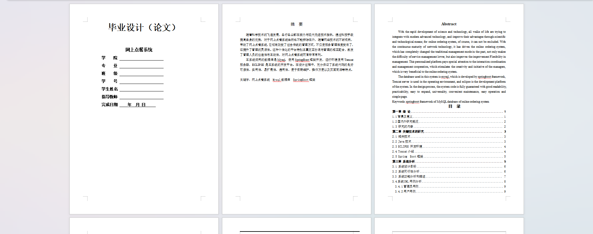

基于Springboot的网上点餐系统（程序+论文）
=
### 完整代码获取地址：从戎源码网 ([https://armycodes.com/](https://armycodes.com/))
### 作者微信：19941326836  QQ：952045282 
### 承接计算机毕业设计、Java毕业设计、Python毕业设计、深度学习、机器学习
### 选题+开题报告+任务书+程序定制+安装调试+论文+答辩ppt 一条龙服务
### 所有选题地址https://github.com/nature924/allProject

一、项目介绍
---
系统包含两种角色：用户、管理员，系统分为前台和后台两大模块，主要功能如下：

### 1 用户功能模块

首页  
用户点击进入系统操作界面，可以查看首页、个人中心、美食订单管理、美食评价管理、我的收藏管理等功能模块。  

个人信息  
用户可以查看并修改个人信息，包括用户账号、姓名、性别、年龄、头像、手机、配送地址等。  

美食评价管理  
用户可以查看店铺账号、店铺名称、美食名称、用户账号、用户姓名、图片、评分、评价内容、评价时间等信息，并进行详情查看、修改或删除操作。  

我的收藏管理  
用户可以查看收藏的美食名称、图片等信息，并进行详情查看或删除操作。  

### 2 管理员功能模块

管理员登录  
管理员通过填写用户名、密码和角色完成登录。登录后可以进入系统操作界面，查看首页、个人中心、用户管理、美食店管理、美食分类管理、美食信息管理、美食订单管理、美食评价管理、系统管理等功能模块。  

用户管理  
管理员可以查看用户账号、姓名、性别、年龄、头像、手机、配送地址等信息，并进行修改或删除操作。  

美食店管理  
管理员可以查看店铺账号、店铺名称、照片、联系电话、店铺介绍、店铺地址、招聘美食、联系人等信息，并进行修改或删除操作。  

美食分类管理  
管理员可以查看美食分类信息，并进行修改或删除操作。  

美食信息管理  
管理员可以查看美食名称、美食分类、店铺账号、店铺名称、联系电话、图片、口味、特色、价格等信息，并进行修改或删除操作。  

美食评价管理  
管理员可以查看店铺账号、店铺名称、美食名称、用户账号、用户姓名、图片、评分、评价内容、评价时间等信息，并进行修改或删除操作。  

美食资讯  
管理员可以查看标题、简介、图片等信息，并进行修改或删除操作。  

轮播图管理  
管理员可以管理首页轮播图，包括新建、修改或删除轮播图图片。  

### 3 美食店功能模块

首页  
美食店点击进入系统操作界面，可以查看首页、个人中心、美食信息管理、美食订单管理、美食评价管理等功能模块。  

个人信息  
美食店可以查看并修改店铺账号、店铺名称、照片、联系电话、店铺介绍、店铺地址、招聘美食、联系人等信息。  

美食信息管理  
美食店可以查看美食名称、美食分类、店铺账号、店铺名称、联系电话、图片、口味、特色、价格等信息，并进行详情查看、修改或删除操作。  

美食评价管理  
美食店可以查看店铺账号、店铺名称、美食名称、用户账号、用户姓名、图片、评分、评价内容、评价时间等信息，并进行详情查看、修改或删除操作。  

### 4 前台首页功能模块

首页  
用户在系统首页可以查看首页、美食店、美食信息、美食评价、美食资讯、个人中心、后台管理等内容。  

用户注册  
用户在注册页面可以填写账号、密码、姓名、性别、年龄、手机、配送地址等信息进行注册。  

用户登录  
用户在登录页面通过填写账号、密码完成登录。登录后，用户可以查看美食信息，包括美食名称、美食分类、店铺账号、店铺名称、联系电话、图片、口味、特色、价格等，并进行点餐、收藏等操作。

二、项目技术
---
- 编程语言：Java
- 数据库：MySQL
- 项目管理工具：Maven
- 前端技术：VUE、HTML、Jquery、Bootstrap
- 后端技术：Spring、SpringMVC、MyBatis

三、运行环境
---
- 操作系统：Windows、macOS都可以
- JDK版本：JDK1.8以上都可以
- 开发工具：IDEA、Ecplise、Myecplise都可以
- 数据库: MySQL5.7以上都可以
- Tomcat：任意版本都可以
- Maven：任意版本都可以

四、运行截图
---
### 论文截图：

### 程序截图：

